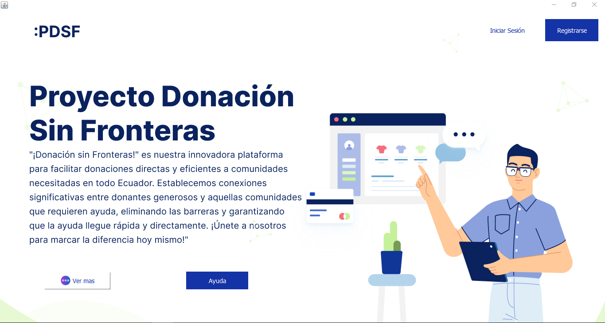
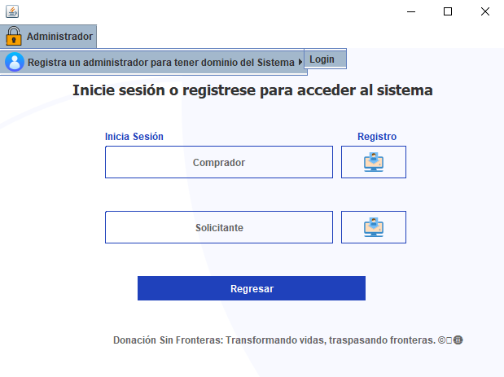
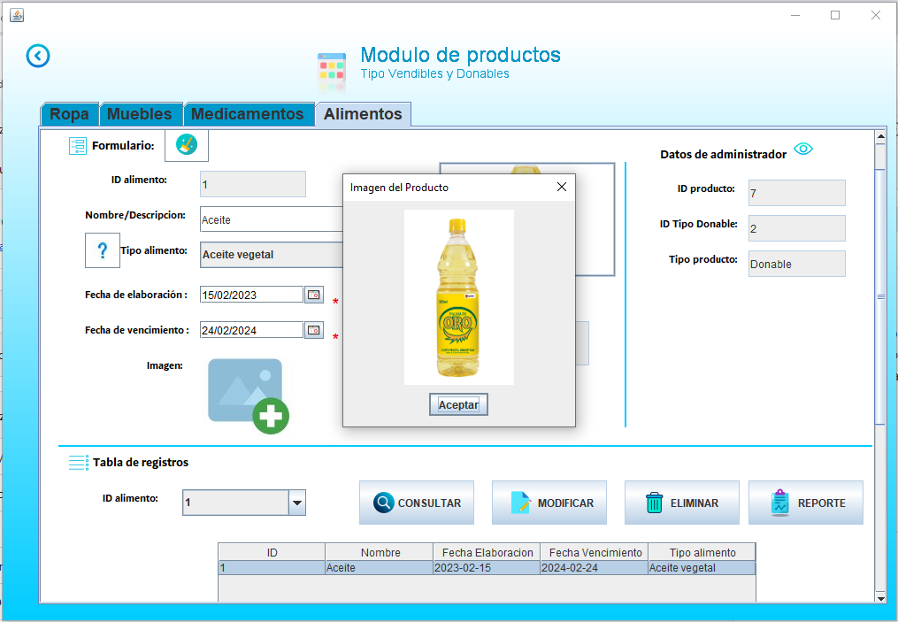
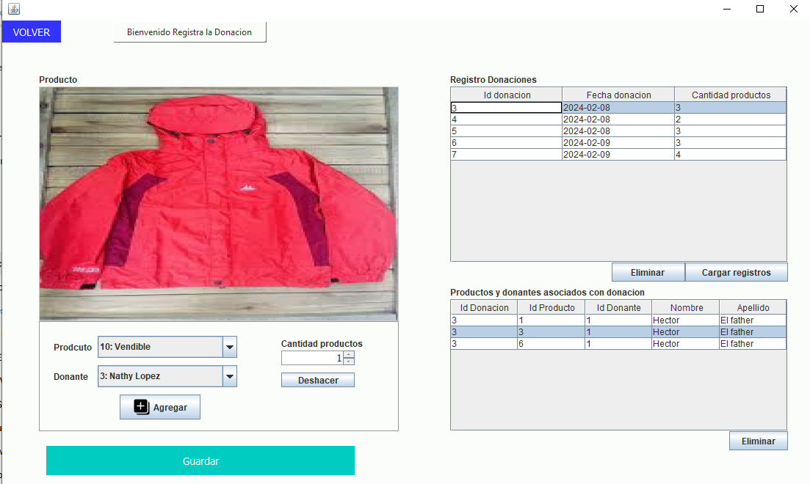
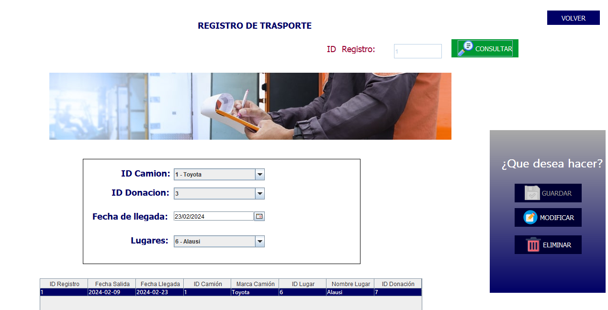
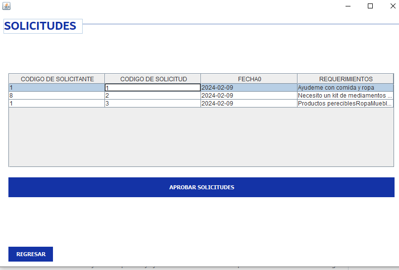
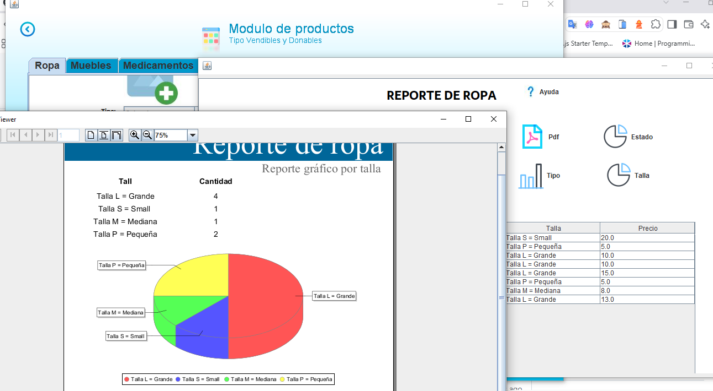

#  Sistema de Gestión - Donación Sin Fronteras

## 📌 Descripción del Proyecto

**Donación Sin Fronteras** es una aplicación de escritorio desarrollada en **Java** bajo el patrón de arquitectura **MVC (Modelo-Vista-Controlador)**. El sistema fue concebido para optimizar la logística, registro, recepción y distribución de donaciones humanitarias hacia centros de acopio y zonas afectadas por emergencias o desastres naturales en todo el país.

El sistema permite gestionar de manera centralizada la trazabilidad completa desde la captación del donante, administración de inventario (alimentos, medicamentos, vestimenta, enseres), logística de transporte mediante asignación de unidades y conductores, hasta el control de solicitudes e informes de entrega.

---

## ✨ Características Principales

* **🔐 Autenticación y Control de Accesos:** Inicio de sesión seguro con roles diferenciados (Administrador, Donante, Solicitante, Comprador, Conductor).
* **📦 Gestión de Productos e Inventarios:** Módulos para categorizar artículos en *Donables* (alimentos con fecha de caducidad, medicamentos) y *Vendibles/Enseres* (ropa, muebles).
* **🚛 Logística y Transporte:** Registro de vehículos/camiones, asignación de conductores con licencias y planificación de rutas de envío desde centros de acopio hacia lugares afectados.
* **📝 Gestión de Solicitudes y Aprobaciones:** Flujo de aprobación para peticiones realizadas por entidades o personas vulnerables.
* **📊 Generación de Reportes:** Integración con **JasperReports** para la emisión de informes y facturación.

---

## 🛠️ Tecnologías y Herramientas Utilizadas

* **Lenguaje de Programación:** Java (Swing para Interfaz Gráfica / NetBeans)
* **Base de Datos:** PostgreSQL (Administrado con pgAdmin 4)
* **Arquitectura:** Modelo - Vista - Controlador (MVC)
* **Librerías / Reporting:** JasperReports, Regex Pattern Matching para validaciones de datos
* **Herramientas de Diseño y Diagramado:** Draw.io, Jira Software (metodología ágil)

---

## 📐 Modelo de Base de Datos

El sistema implementa una base de datos relacional PostgreSQL con herencia de tablas y relaciones bien estructuradas (`persona`, `administrador`, `donante`, `solicitante`, `conductor`, `donacion`, `centroAcopio`, `lugarAfectado`, `camion`, `registro_transporte`, entre otras).

---

## 👨‍💻 Equipo de Desarrollo & Contribuciones

Proyecto integrador desarrollado para la carrera de **Tecnología Superior en Desarrollo de Software** (Periodo Octubre 2023 - Febrero 2024).

### Integrantes:
* **Bryan Farez** *(Contribuyente)* 
* **Isaac Villa**
* **Edwin Morocho**
* **José Benavides**
* **Erick Guarango**

### 🎯 Mis Contribuciones (Bryan Farez):
* **Modelado y Diseño BD:** Participación en la elaboración de diagramas Entidad-Relación, Relacional Normalizado y creación del script DDL en PostgreSQL.
* **Desarrollo de Módulos (MVC):** Implementación de clases de modelo, vistas Swing y controladores para la lógica de negocio y operaciones CRUD.
* **Validaciones e Integridad:** Aplicación de expresiones regulares (*Matches / Pattern*) para validación de entradas de usuario.
* **Pruebas y Reportes:** Ejecución de pruebas unitarias/de integración del sistema e integración de reportes con JasperReports.

---
## 📸 Capturas de la Interfaz

| Pantalla de Inicio (Home) | Autenticación de Usuarios |
| :---: | :---: |
|  |  |

| Registro de Productos | Gestión de Donaciones |
| :---: | :---: |
|  |  |

| Logística y Transporte | Aprobación de Solicitudes |
| :---: | :---: |
|  |  |

| Reportes y Estadísticas |
| :---: |
|  |
